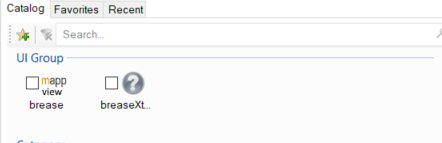
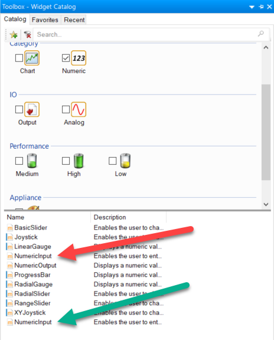

Please check each widget for requirements and minimum versions for Automation Studio and mappView.

To use the widget collection 

1. Close Automation Studio
2. Download the folder 'breaseXtended' and copy it in your Automation Studio project into the folder '\Logical\mappView\Widgets'.
3. Start Automation Studio

The new widget group 'breaseXtended' is now available in the toolbox.

The widgets can also be found by selecting the category or using the search field. If the widget is an extension of an existing widget it may have the same name. Make sure to pick the correct one.

