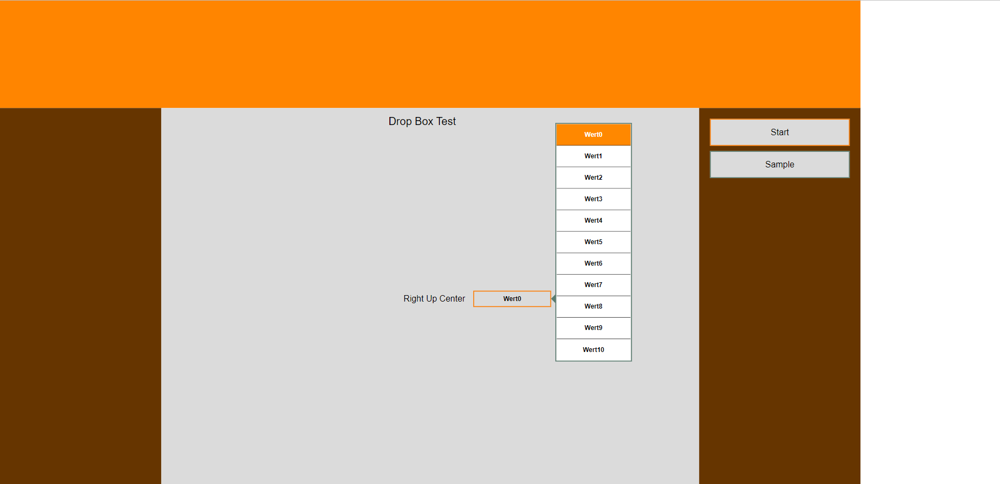

## Description
This widgets extends the standard drop down box. The standard drop down box always opens the list box downwards. This can be an issue when the drop down box is already at the bottom of the screen. This drop down box also allows the list box to open to the top or centered.

The following additional functions are available

* Additional property listPositionExt

## Usage

#### Properties

**listPositionExt**

This property extends the existing property listPosition.

* 0, List position is identical to default widget.
* 1, The list box will open from the button bottom upwards (DropUpBox).

* 2, the list box will always try to center the list box to the screen.

## Requirements

* Automation Studio 4.11
* Minimum version required 5.16
* Expected to work with later version

May also work with lower version: **YES**

## Revision History

##### Version 3
- Sometimes list box is not aligned with bottom widget

##### Version 2
- Switched from copy original DropDownBox widget to inherited version

##### Version 1
- First release

