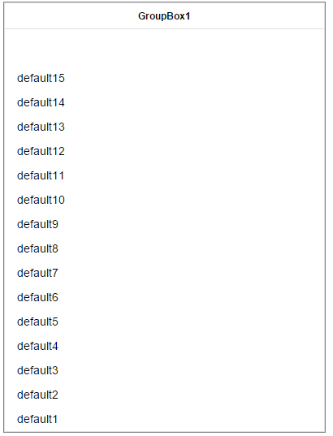

## Description
This widget extends the standard group box. The following additional functions are available

* Additional property "verticalAnchorTop" as boolean

## Usage

#### Properties

**verticalAnchorTop**

This property is use to anchor top or bottom the items in a group box that already got "childPositioning" at "relative" and "alignment" at "vertical".

If "verticalAnchorTop" is "true" it's default value and there is no change at the standard group box.
If it's "false", list is inverted like this:

## Limitations

## Requirements

Tested with

* Automation Studio 4.12
* mappView 5.24

May also work with lower version: **YES**

## Revision History

##### Version 1
- First release

