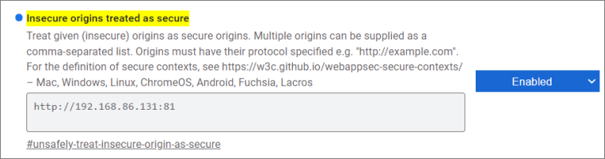
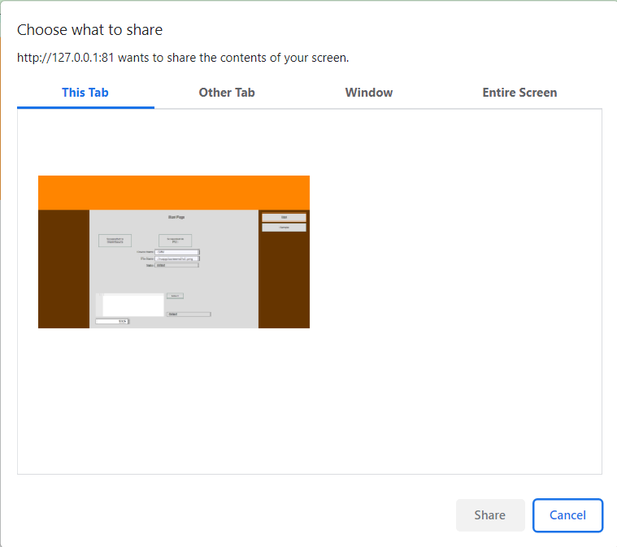
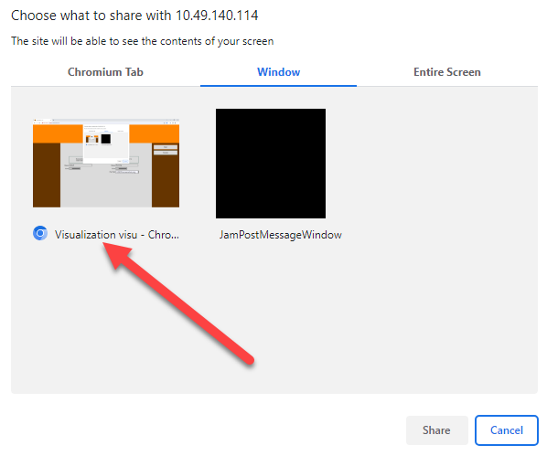
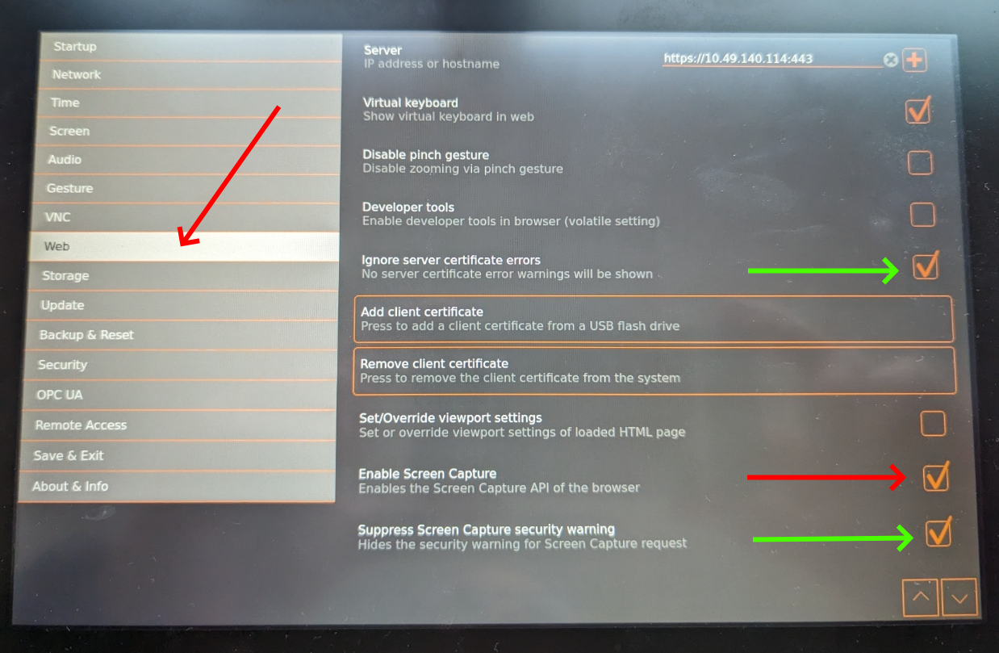
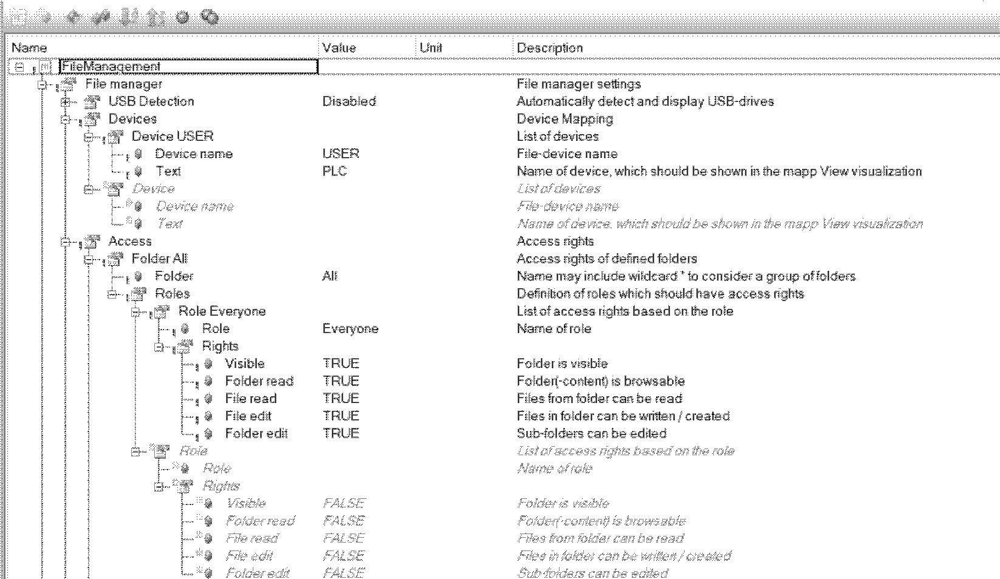

## Description
This widgets creates a screenshot of the client visualization and stores it on the PLC or the client device. The widget is dervived from the button widget and therefore shares all its settings, actions and events. 

## Windows / Linux
Due to browser security restrictions the screen access is blocked for standard HTTP connections which is the default for mappView. mappView must be changed to HTTPS access or the HTTP URL must be added to the browser as an exception. Use the following line in the browser URL to access the flag

```chrome://flags/#unsafely-treat-insecure-origin-as-secure```



Add the mappView URL and enable the flag.

When the screenshot is called it will open a window that will ask the user what to share. 



Select the tab or region for the screenshot and hit the Share button.

## Suppress pop-up
To avoid the additional pop you can use the browser switch "--auto-select-desktop-capture-source". In my test this only worked for Window Tab. Make sure you start the browser with URL and that only one tab is open. The switch needs the window name as parameter. For the screenshot below the complete switch would be "--auto-select-desktop-capture-source="Visualization visu"

Note that you might see the pop flash for a second before the screenshot is taken.



## B&R Panels
Due to browser security restrictions the screen access is blocked for standard HTTP connections which is the default for mappView. mappView must be changed to HTTPS access or the HTTP URL must be added to the browser as an exception. On B&R panels the screen capture must be enabled in the panel settings. This option is available starting with firmware 1.6.x. In the web settings enable screen capture and optional suppress the security warning for the screen capture and server certificate.




## Usage
The libraries **MpFile** and **MpServer** must be added to the project under libraries. This widget requires mapp File (see Automation Studio help GUID f5ac430b-e0ca-4320-bcd0-b7e28a087f77). Make sure that there is a valid mpfilemanager configuration. Only the configuration is required, no additional task or function block must be added to the project. The mpfilemanager configuration should look like this:



#### Additional Actions
The widget derives all actions from the button widget.

**Screenshot2Client**
This action creates a screenshot and saves it to the client device.

**Screenshot2Plc**
This action creates a screenshot and saves it to the PLC. This action needs two parameters

* filePath - Full path to the screenshot image including the filename and extension. 

Example

USER/screenshot.png
USER is the storage medium specified in the target system configuration.


#### Additional Events
The widget derives all events from the button widget.

**FileSaved**

This event is called when the Screenshot2Plc has saved the screenshot successful. Returns the full path of the file (filePath).

**FileDownloaded**

This event is called when the file was downloaded with Screenshot2Client successful. 

**OnError**

This event is called when a screenshot was not successful. Returns the error number (result). Most error numbers are generated from underlying components and can be found in the Automation Studio help. The widget can also generate the following custom error numbers.

| Error No  | Description  |
|---|---|
| 10000  | Unknown error. Can occur when the user aborts the screenshot |
| 10001  | HTTP permission. This error occurs when the widget can not access the screen. Use HTTPS access or use flag as described above. |
| All other  | All other error numbers come from the runtime and can be found in the Automation Studio help file |


**Typical issues**

- Error -1064165351: Cannot create file

    Typical reasons for this error are
    - The file device does not exist in the PLC configuration
    - The path is not correct, folders do not exist
    - The device is not configured in the mpfilemanager
    - The permissions in the mpfilemanager configuration are not sufficient

- Error -1064236540: 

    Typical reasons for this error are
    - The mpfilemanager configuration is missing
    - The device is not configured in the mpfilemanager
    - The permissions in the mpfilemanager configuration are not sufficient

## Requirements

Tested with

* Automation Studio 4.11
* B&R T-Panels firmware 1.6.x 
* Minimum tested version 5.15
* Expected to work with later version

May also work with lower version: **YES**

## Revision History

##### Version 7
- Fixed an issue where repeated screenshots on T-Panels will drive CPU load up to 100%

##### Version 6
- Error 10000 now generates some additional details in the logger message

##### Version 5
- Fixed save to PLC did not work on pre-cached pages

##### Version 4
- Changed device name and file name to filePath to be compatible with other widgets 
- Removed obsolete code 
- Add error messages to PLC logger 

##### Version 3
- Widget is now compatible to B&R T-Panels

##### Version 2
- Optimized screenshot widget

##### Version 1
- First release

