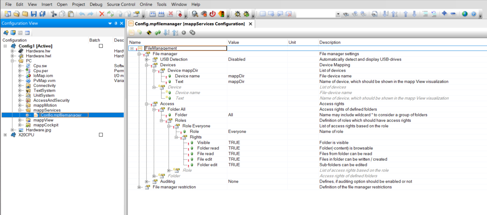

## Description
This widgets allows the user to transfer files between the PLC and the client system through the HMI. 

## Usage
This widget requires mapp File (see Automation Studio help GUID f5ac430b-e0ca-4320-bcd0-b7e28a087f77). The libraries **MpFile**, **MpBase** and **MpServer** are required and must be added to project. Make sure that there is a valid mpfilemanager configuration. The image shows a valid sample configuration.

The file device USER can be used without any additional configuration. All other file devices require a file device configuration. The file device configuration can be found in the target system configuration.

#### Properties

**maxFileSize**

This is the maximum size of the transferred file. Larger files will generate an error. The maxiumum value may vary on PLC performance and should be between 1.000 - 10.000.000 bytes. Values larger than 10 MB will be rejected.

#### Additional Actions
The widget derives all actions from the button widget.

**Download**
This action downloads a file from the PLC to the client.

* filePath - Full path to the file including the device name, filename and extension. Do **NOT** add 'FileDevice:' before the device name!

Example

mappDir/screenshot.png

mappDir is the device name specified in the target system configuration.

**Upload**
This action uploads a file and saves it on the PLC.

* filePath - Directory where the file should be saved. Do **NOT** add 'FileDevice:' before the device name!

Example

mappUser/

#### Additional Events
The widget derives all events from the button widget.

**FileSaved**

This event is called when the file was saved on the PLC after an upload action. Returns the full path of the file (filePath).

**FileDownloaded**

This event is called when the file was downloaded successful. 

**OnError**

This event is called when a transfer was not successful. Returns the error number (result). Most error numbers are generated from underlying components and can be found in the Automation Studio help. The widget can also generate the following custom error numbers.

| Error No  | Description  |
|---|---|
| 10000  | Unknown error. Can occur when the user aborts the screenshot |
| 10101  | File size error. The file larger than the parameter maxFileSize |
| 10102  | File parameter error. The value for maxFileSize should be between 1.000 - 10.000.000 bytes |

## Requirements

Tested with

* Automation Studio 4.12
* Minimum tested version 5.15
* Expected to work with later version

May also work with lower version: **YES**

## Revision History

##### Version 1
- First release

